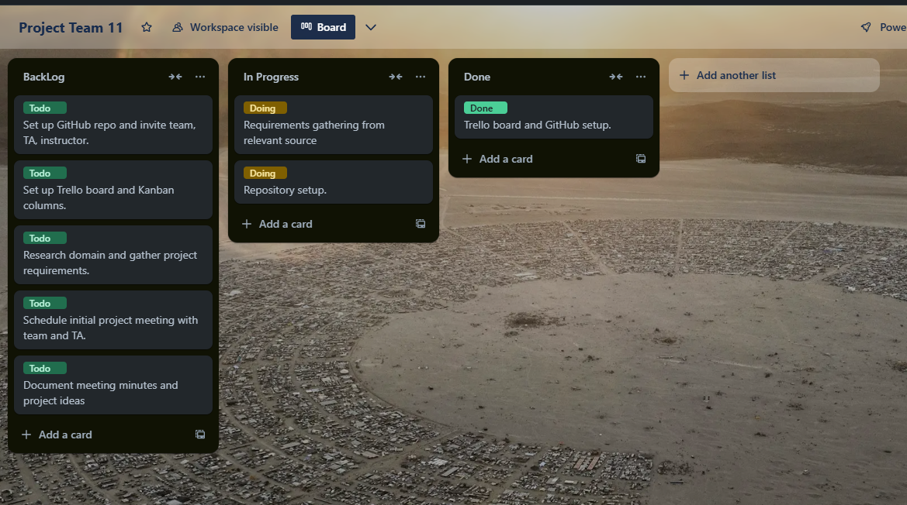

# Project Team 11 



## Team Members:
- Cartson Viator
- Timothy Erbert
- Dylan Snyder
- Jean Affa
- Kyle Youngquist

## Teaching Assistant:
- Saba Jazi

## Project Overview:
This repository contains the source code, documentation, and project management materials for Project Team 11.

## Sprint 0 Goal:
The main objective of Sprint 0 is to familiarize the team with the project domain, set up the necessary tools and environments, and gather overall project requirements.

## Repository Structure:
```bash
project-repo/
│
├── Sprint-0/
│   ├── meeting-minutes.md      # Notes from team meetings
│   ├── requirements.md         # Project requirements gathered in Sprint 0
│
├── README.md                   # Project overview (this file)

```

Link to our Kenban [Board](https://trello.com/invite/b/66e4ab0efff9480e0a073512/ATTI84a94e58ccee003d9a23db8edf825de803303C81/project-team-11)